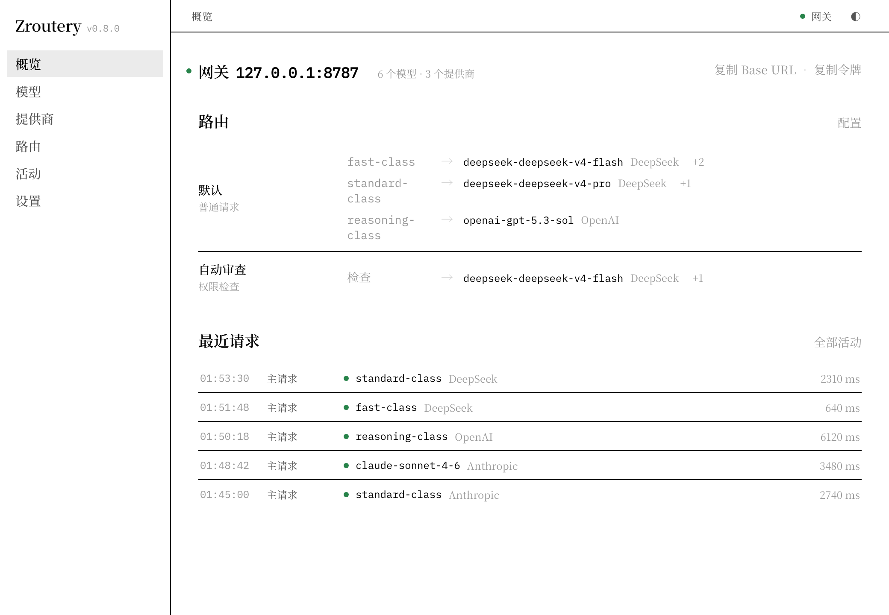
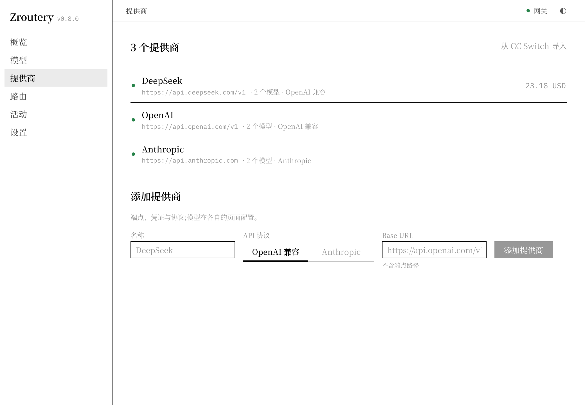
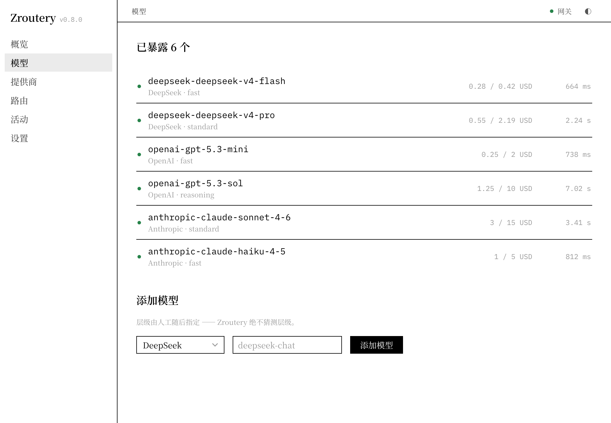
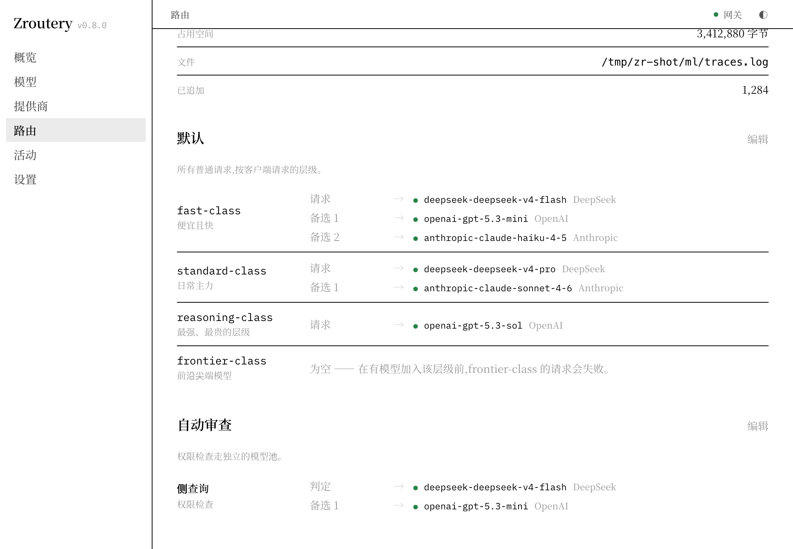
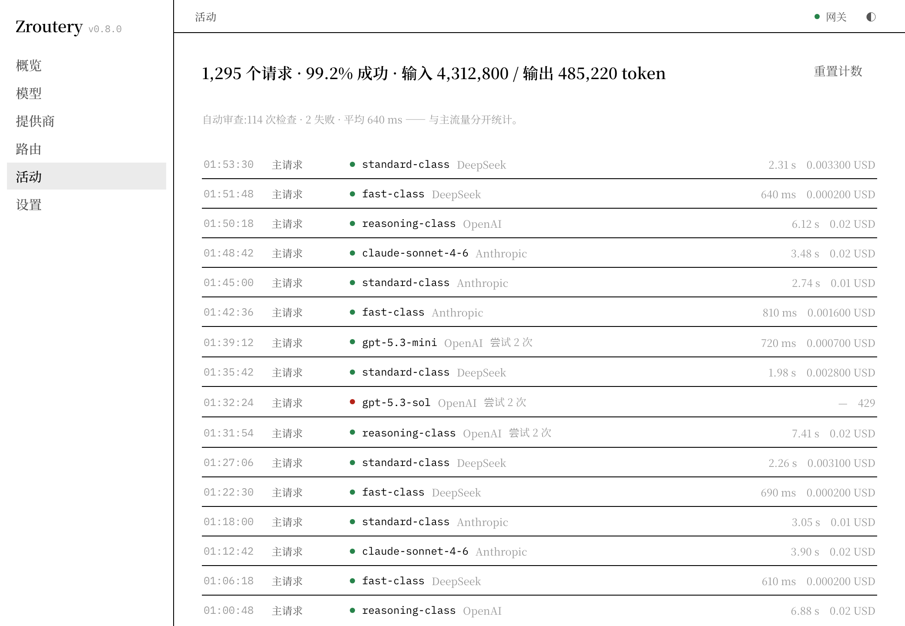
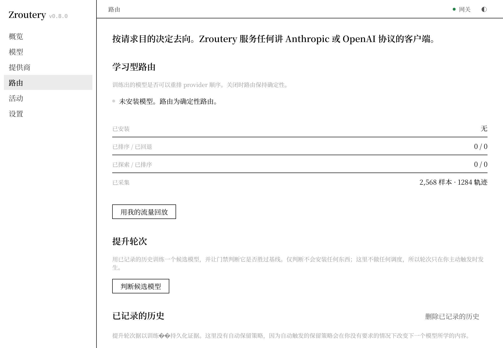

# Zroutery

把多个大模型供应商聚合成**一个本地端点**。

客户端说 Anthropic、OpenAI Chat、OpenAI Responses 还是 Gemini 协议都行；Zroutery 负责把它们翻译成同一套内部表示、挑一个模型、失败就换一个、把账记清楚，最后再用客户端本来说的那种协议讲回去。

macOS 和 Windows 上它是一个常驻菜单栏 / 托盘的桌面应用，关掉窗口也不退出；不想开界面时，也可以只跑代理进程。



## 它实际解决的事

- **一套配置，服务所有客户端。** Claude Code、Codex、Chatbox、任意 SDK 或脚本，指同一个本地地址就行。
- **模型分档，而不是写死。** 每个模型归到 fast / standard / reasoning / frontier 之一，客户端只写 `standard-class`；具体谁来接，由你排的优先级、路由策略和实时健康状态决定。
- **失败不糊弄。** 超时、限流、上游半截流、协议不兼容，各自有分类；熔断、半开探针、请求整流和失败转移按同一张表决策，过程进请求记录。
- **钱有上限。** 按总量 / 供应商 / 档位设日或月预算，超额可以拒绝或降级到便宜档；花费落盘，重启不丢。
- **密钥不进配置文件。** API key 存在系统凭据库，配置里只留一个引用。

## 快速开始

### 环境

- Rust 1.89 或更新（`Cargo.toml` 的 `rust-version`，CI 用 1.89.0 验证过锁定依赖能编）
- Node 20.19+ 或 22.12+，pnpm
- macOS 11+ 与 Xcode Command Line Tools，或 Windows 与 WebView2 运行时

### 跑起来

```sh
pnpm install
pnpm dev      # 开发模式
pnpm build    # 打包：macOS 出 .app/.dmg，Windows 出 .msi 和 NSIS 安装器
```

桌面版启动后没有 Dock 图标，只在菜单栏 / 托盘里：从这里打开窗口、启停网关、复制地址和 token，退出也在这一份菜单里。网关默认跟着应用一起开始监听（设置里可以关掉），关掉窗口只是把窗口藏起来，代理继续跑。

不想要界面，只要代理：

```sh
cargo run -p zroutery-headless
```

无界面运行时 key 从环境变量读，例如 `ZROUTERY_KEY_PROVIDER_DEEPSEEK=sk-...`（`provider:deepseek` 对应 `ZROUTERY_KEY_PROVIDER_DEEPSEEK`）。配置目录可以用 `ZROUTERY_CONFIG_DIR` 指到别处。

### 第一次配置

1. **供应商**页加一个上游：名字、协议（OpenAI 兼容或 Anthropic）、Base URL，然后粘贴 API key。key 直接写进系统凭据库，不落配置文件。已经用 CC Switch 管着一堆中转站的话，这里能直接导入。

   

2. 在供应商详情里拉一次模型目录，把要用的模型加进来。

3. **模型**页给每个模型指定层级。这一步没有猜测：没指定层级的模型照样能用完整 id 调用，只是不参与 `*-class` 路由，页面会一直提醒你。层级 id 的写法（`fast-class`，还是 Anthropic 的 `haiku-class`、OpenAI 的 `luna-class`）可以在设置里换。

   

4. **路由**页排出每个层级的顺序——默认按优先级数字，也可以改成按实测延迟和价格选举——顺便设失败转移次数和熔断参数。排好之后，这一页会按路由真实会尝试的顺序把每个层级展开给你看。

   

### 接上客户端

网关默认在 `http://127.0.0.1:8787`，端口和监听地址都能改。四种方言各有一个入口：

| 客户端说的协议 | 入口 |
| --- | --- |
| Anthropic Messages | `POST /v1/messages` |
| OpenAI Chat Completions | `POST /v1/chat/completions` |
| OpenAI Responses | `POST /v1/responses` |
| Gemini generateContent | `POST /v1/generateContent` |

另外还有 `GET /v1/models`（列出所有可调用的 id）、`GET /v1/status` 和 `GET /health`（唯一免鉴权的接口）。

鉴权用 `x-api-key` 或 `Authorization: Bearer`，token 在右上角「网关」菜单里复制。

读环境变量的客户端，比如 Claude Code：

```sh
export ANTHROPIC_BASE_URL=http://127.0.0.1:8787
export ANTHROPIC_AUTH_TOKEN=<粘贴 token>
export ANTHROPIC_MODEL=standard-class
```

OpenAI 系的客户端：

```sh
export OPENAI_BASE_URL=http://127.0.0.1:8787/v1
export OPENAI_API_KEY=<粘贴 token>
```

## 架构

一条请求穿过四道边界：**客户端协议 → 统一 IR → 路由 → 上游**，回来时再反着走一遍。

```
客户端 ── Anthropic Messages / OpenAI Chat / Responses / Gemini
  │
  ├─ 解码为 IR：ChatRequest / ChatResponse / StreamEvent
  ├─ 鉴权，预算准入，识别自动审查侧请求，匹配路由策略
  ├─ 解析客户端给的 id：直连某个模型，或落进某个 *-class 层级
  ├─ 排序候选：策略顺序、能力过滤、熔断与半开状态、可选的选举/学习重排
  ├─ 逐个尝试：编码成上游方言 → 发送 → 失败则分类、整流、换候选
  └─ 按客户端方言编码回去，同时结算：预算账本、请求记录、
     健康观测、Outcome、影子决策
```

**为什么要中间那层 IR。** 客户端有四种方言，上游目前有两种（Anthropic、OpenAI 兼容），两两直连就是 8 套翻译代码；有了 IR 只需要每边一组编解码器，上游侧只用到两个。Responses 和 Gemini 的编解码器已经写好并有测试，但还没有对应的上游类型，所以它们现在只作为入口方言存在。

几个贯穿全局的选择：

- **一次请求一条生命周期。** 尝试、失败分类、整流重试、结算、统计、终态结果都挂在同一个生命周期对象上，只在终态结算一次——流式也一样，客户端中途断开也是一种明确的终态。
- **失败有一张分类表。** 某个错误是否影响健康、是否触发熔断、能否重试、能否换候选、算不算供应商的问题，由一张表统一决定，而不是散落的条件分支。
- **准入先于检查。** 请求进来时先对涉及的预算 scope 取许可，结算后释放，所以「最多超出一笔请求」这句话是成立的；没配预算的 scope 彼此不阻塞。
- **观察与决策分开。** 健康与延迟观测喂给路由；影子决策和数据集只负责记录，默认没有任何自动训练会改变线上选路。

## 模块

**`crates/zroutery-core`** — 引擎本体，不依赖 GUI。

| 模块 | 负责 |
| --- | --- |
| `protocol/` | 四种方言的请求/响应编解码与 SSE 解析；`ProviderQuirks` 处理各家兼容差异 |
| `ir/` | 统一的请求、响应、流事件；Responses 的内存会话存储与取消 |
| `server/` | HTTP 路由、鉴权、请求管线（尝试循环、整流、终态结算、影子采集） |
| `router` `policy` `election` `registry` `circuit_breaker` | 候选解析与排序、策略匹配、按实测延迟/价格的选举、逐模型熔断与半开探针 |
| `budget` `billing` | 预算 scope 与落盘账本、价格与成本、余额探针 |
| `stats` `stats_ext` `observation` `outcome` `failure` | 请求记录、EWMA 与分位延迟、健康观测、唯一的终态结果与失败分类 |
| `media/` `rectifier/` | 视觉兜底（图片转描述）；请求被上游拒绝后的就地修复 |
| `classifier` `query` `session` | 自动审查侧请求的识别与判定、会话亲和 |
| `ml/` | 学习栈：影子决策、数据集、特征、训练/校准/bandit、离线发布门禁、晋升与回滚、轨迹日志 |
| `account/` | 账号身份、额度、用量与签到（可选 feature，默认不编进构建） |
| `migration` `agent_takeover` | 从别的路由器迁出、接管客户端配置——目前只有库和测试在调用 |

**`src-tauri`** — 桌面外壳，包名 `zroutery`：进程内跑上面的引擎，提供 Tauri 命令、托盘菜单、窗口与开机启动、凭据库读写、CC Switch 导入。
**`crates/zroutery-headless`** — 无界面代理二进制，复用桌面库；key 支持环境变量，另有 `--elect`、`--balances`、`--experiment` 几个子命令。
**`ui/`** — Vite + React 仪表盘，构建产物由 Tauri 加载；中英双语，主题跟随系统。
**`scripts/`** — 验证脚本：端到端 smoke、UI 布局回归、UI 交互回归、提交信息契约、工具链门。

## 数据放在哪

| 内容 | 位置 | 说明 |
| --- | --- | --- |
| 配置 | `config.json`：macOS 在 `~/Library/Application Support/app.zroutery.desktop/`，Windows 在 `%APPDATA%\app.zroutery.desktop\`，可用 `ZROUTERY_CONFIG_DIR` 覆盖 | 不含密钥；文件损坏时先复制一份备份，再用默认值起来 |
| API key | 系统凭据库（macOS 钥匙串 / Windows 凭据管理器） | 配置里只有 `key_ref` |
| 预算账本 | 配置目录下的 `spend.json` | 定时与退出时写盘 |
| 学习轨迹 | 配置目录下的 `ml/traces.jsonl` | 只有开启影子后才追加 |
| 请求记录、健康、延迟统计、Responses 会话 | 内存 | 都有上限；重启清空，不落盘 |

## 平台与发布边界

- **macOS 11+**：出 `.app` 和 `.dmg`；常驻菜单栏，没有 Dock 图标；开机启动用 LaunchAgent。签名是 ad-hoc，仓库里没有公证流程。
- **Windows**：出 `.msi` 和 NSIS 安装器；凭据走 Windows 凭据管理器。CI 每晚会真的装一次、重装、卸载，验证安装器。
- **Linux**：代码里有几处平台分支，但凭据库依赖在 Linux 上不参与构建，也没有 Linux 打包目标或 CI 任务——目前不支持。
- **上游**：当前只有 Anthropic 和 OpenAI 兼容两种供应商类型；Gemini 与 Responses 作为入口可用，作为上游还没接线。

## 看得见的状态

界面不是只看配置。**活动**页把每个请求的入口方言、实际走的模型、尝试次数、延迟、token 和花费列出来；下面按模型汇总成功率和支出，熔断计数可以单独清零，也能整体重置统计。自动审查的侧请求分开统计，免得混进主流量里看不清。

请求正文不会被记下来：记录里只有元数据，上游返回的错误正文也会在写进记录前截断，免得把凭据或内部地址留在内存里。



预算在**设置**页配置：按总量、供应商或档位设日/月上限，超额选择直接拒绝或者降级到更便宜的档位。已用量和限额同屏显示，账本落在 `spend.json` 里。

## 学习型路由（默认关闭）

桌面构建默认把 `ml` 编进去，但**默认什么都不做**：影子记录和学习型重排都关着，所以新装的应用不采集、不训练、也不会因为模型而改变选路。

打开影子之后，每个走策略路由的请求会多记一条反事实决策——「如果按模型打分，会选谁」。内置了一个经过校验的候选模型用来算这个决策，它只能写记录，碰不到真正发出去的请求。

完整的闭环是：采集 → 训练 → 离线门禁 → 晋升 → 重排与回滚。目前走在产品路径上的只有采集、轨迹、晋升和回滚；校准、bandit、warmup、离线发布门禁、激活快照这些仍然是库和测试的接口，没有生产调用者，也没有任何自动调度——晋升轮次只在你在界面里主动触发时才发生。



## 开发与验证

```sh
pnpm test                                 # cargo test --workspace
pnpm smoke                                # 起假上游，跑端到端
pnpm test:layout                          # 真实构建的 UI 布局回归
python3 scripts/ui_interaction_test.py    # 真实 UI 交互回归（假 IPC + 无头 Chromium）
cargo clippy --workspace --all-features --all-targets -- -D warnings
cargo fmt --all -- --check
```

提交信息用 Conventional Commits：`<type>(<scope>): <summary>`，CI 会逐条校验。

架构决策、各阶段状态和审查记录都在 `docs/development/` 里，这里不重复。

## 许可

MIT（见 `Cargo.toml` 的 `license`）。
